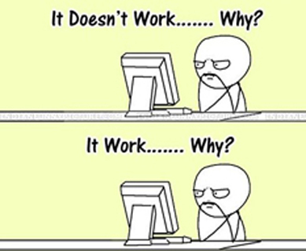

I come from China, and I grow up in Shanghai. I studied pharmaceutical science before. After graduation from Fudan University, I came to this amazing city to pursue master of science degree in Biostatistics in Columbia University.

Let me show you a wonderful picture of my hometown.

This is my favourite food for breakfast in China, I MISS IT A LOT.

my previous life:

my life for now:

Now I am worried about hair loss everyday lol